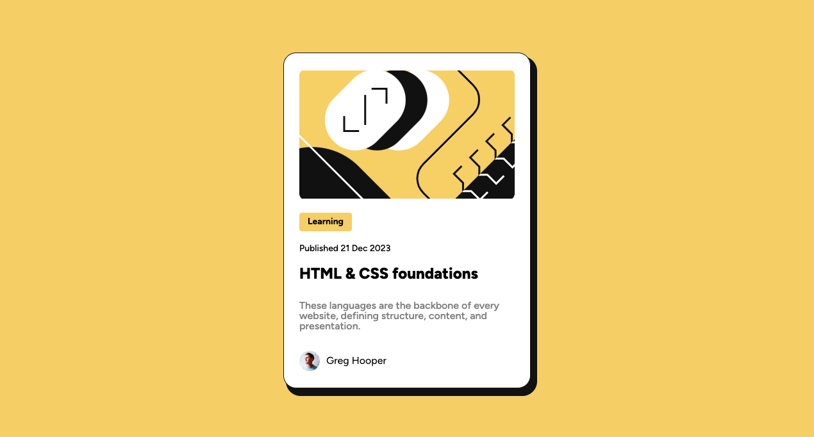

# Frontend Mentor - Blog preview card solution

This is a solution to the [Blog preview card challenge on Frontend Mentor](https://www.frontendmentor.io/challenges/blog-preview-card-ckPaj01IcS). Frontend Mentor challenges help you improve your coding skills by building realistic projects. 

## Table of contents

- [Overview](#overview)
  - [The challenge](#the-challenge)
  - [Screenshot](#screenshot)
  - [Links](#links)
- [My process](#my-process)
  - [Built with](#built-with)
  - [Continued development](#continued-development)
- [Author](#author)

## Overview

### The challenge

Users should be able to:

- See hover and focus states for all interactive elements on the page

### Screenshot

### Links

- Solution URL: https://github.com/darrylrachel/fm-blog-card-preview
- Live Site URL: https://project-blog-card-preview.netlify.app/

## My process

### Built with

- Semantic HTML5 markup
- CSS custom properties
- Flexbox
- Mobile-first workflow

### Continued development

Moving forward with future projects I want to start implementing more Scss and Javascript for some effects over css to sharpen my skills.

## Author

- Website - Darryl Rachel https://trbllabs.com/
- Frontend Mentor - @darrylrachel https://www.frontendmentor.io/profile/darrylrachel
- Twitter - @darryldevydev (https://www.twitter.com/darryldevydev)